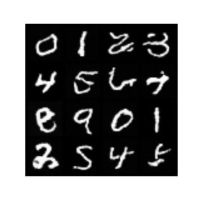
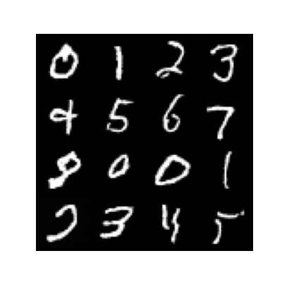
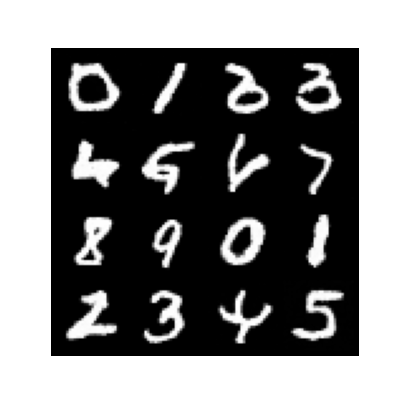
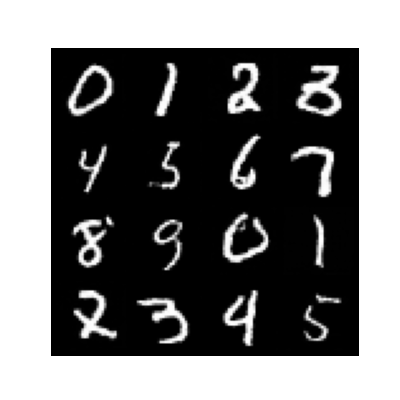
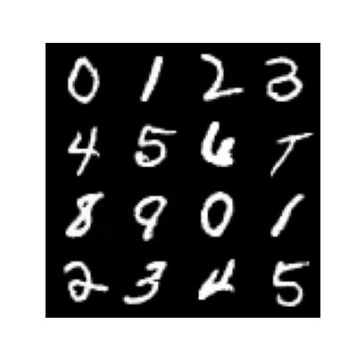
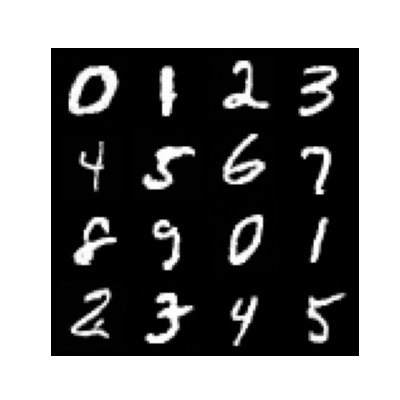

# MNIST_Diffusion_Model

В этом проекте реализована диффузионная вероятностная модель с подавлением шума (DDPM) **с нуля** для генерации рукописных цифр из датасета MNIST.  
Модель обучается обращать постепенный процесс зашумления, начиная со случайного шума и шаг за шагом восстанавливая реалистичные серые изображения цифр размером 28×28 с помощью итеративного денойзинга.

### Возможности
- **Полный пайплайн обучения DDPM** с кастомной архитектурой U-Net  
- **Прямой и обратный процессы диффузии** с линейным расписанием шума  
- **Условная генерация** (опционально, с учётом класса цифры)  
- **Лёгкая и понятная реализация** на PyTorch  
- **Инструменты визуализации** для процесса сэмплирования и кривых функции потерь  

### Результаты
После обучения модель генерирует разнообразные изображения цифр в стиле MNIST, демонстрируя эффективность диффузионных моделей для синтеза изображений на небольших датасетах.

## Результаты обучения по эпохам

В таблице ниже показаны визуальные результаты работы нейросети на разных этапах обучения.

| Эпоха | Результат |
|------:|:---------:|
| 5     |  |
| 10    |  |
| 15    |  |
| 20    |  |
| 25    |  |
| 30    |  |
